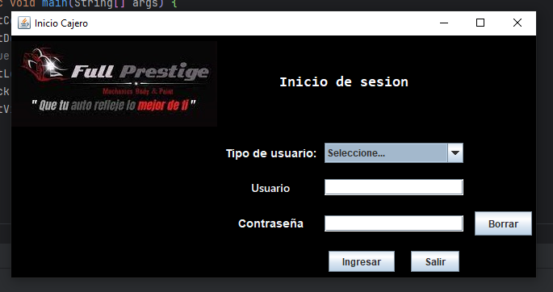
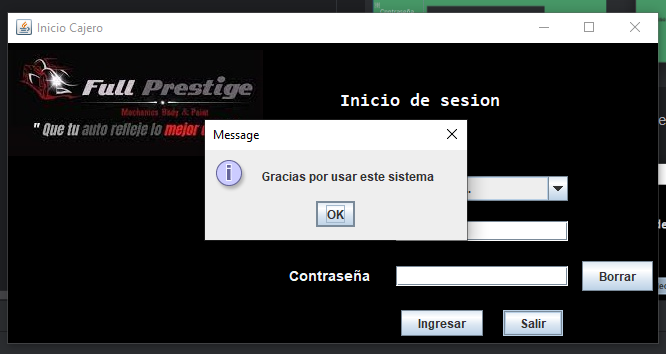

Tema: Sistema de gestión de para una Tienda Automotriz
1) La distribucion de las carpetas y pantallas se las distribuye de la siguiente manera:
   

2) Pantala de inicio de secion *LogIn* creada_ 

3) *Boton ingresar*: Permite al usuario ingresar al sistema con las credenciales correctas 
<b>Credenciales correctas (Que existen en la base de datos)</b>
 
<b>Credenciales incorrectas (No existen registros de ese usuario en la base de datos)</b>
   
4) Boton de salir: permite cerrar el programa y muestra un boton con un mensaje de despedida.
   
5) Ingreso a la pantalla cajero, ingresando las credenciales (usuario: usuario2, password:user2), si las credenciales son correctas permiten el ingreso a la siguiente ventana.
  
  
6) Visualización una vez se ingresado a la pantalla de cajero 
   a) La pantalla cajero se diseño con pestañas que fueron realizadas con JTabbedPane  
   b) Los datos del vendedor son extraidos de la base de datos 
   c) 
   
7) Para las selecciones del producto a comprar de igual manera son datos que se extraen de una conexion a la base de datos MySQL 
   a) La cantidad a elegir y seleccionar productos estan hechos con Combobox 
   b)Para elegir la cantidad se uso un Jspinner  
   

8) Seleccion de Productos 
  a) Una vez seleccionada la imagen se visualizar la imagen del producto a elegir y de igual manera se podra elegir la cantidad que se desee comprar 
  b) En la parte del total se realiza un suma automatica de la cantidad del producto que se desee eligir. 
  

   
9) En caso de no ser llenados los campos del cliente el sistema no permitira procesar la compra
   

10) Al llenar correctamente los campos del cliente permite procesar la compra y la impresión de la factura
    
11) La impresion de la factura se procesa y se lo encuentra en la carpeta señalada
   

